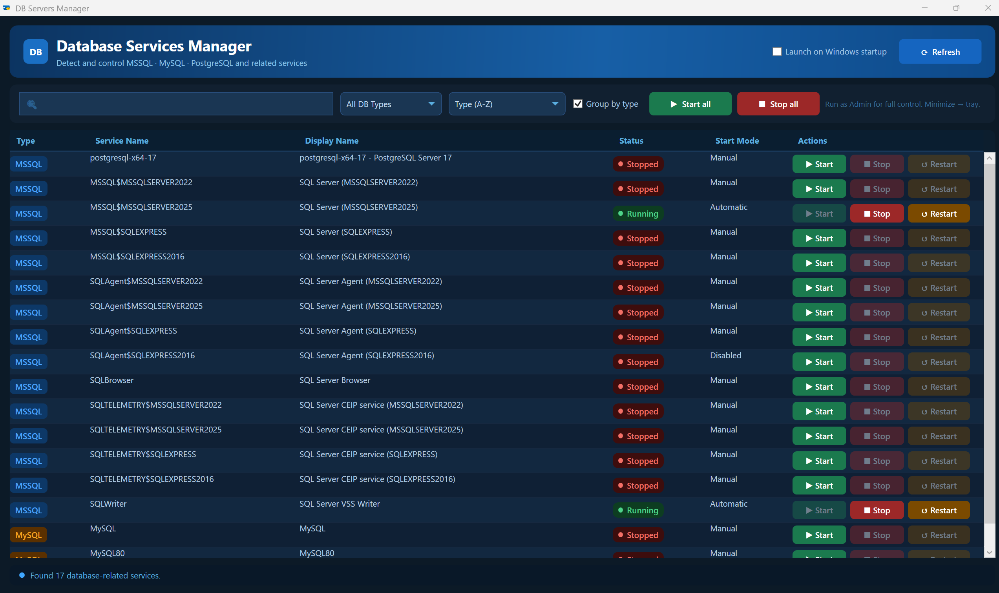

# DB Servers Manager

Windows WPF application to detect and manage local database services (MSSQL, MySQL, PostgreSQL, Oracle, etc.)

## Features
- Scan services for known database engines
- Start / Stop / Restart individual services
- Bulk Start/Stop by engine type
- Search, filter, sorting & grouping in UI
- Minimize to system tray with single-instance behavior
- Installer via Inno Setup

## Usage
1. Build with `dotnet build`
2. Run `dotnet run` from the project folder
3. Use the UI to select services and manage them

## Screenshot

## Git remote
Remote set to: `https://github.com/annguyen209/DBServersManager.git`
